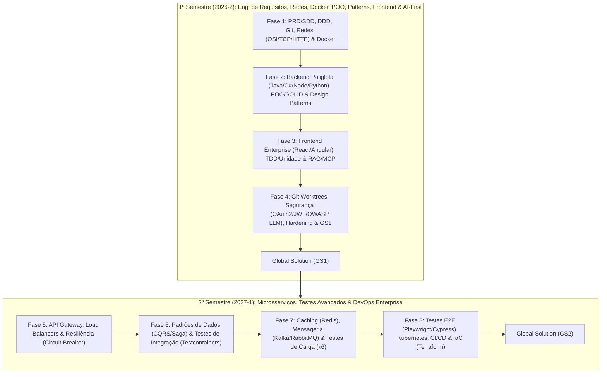
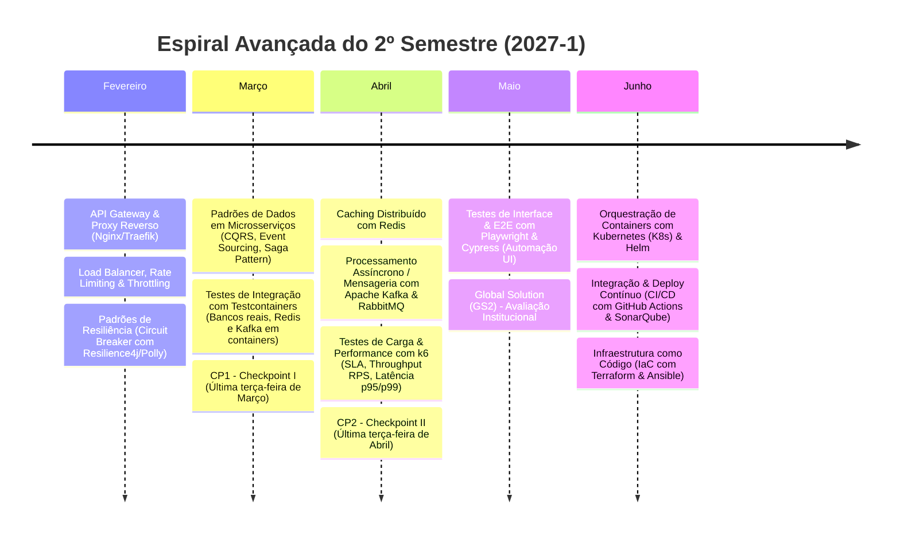

# Plano de Ensino: Metodologia em Espiral, DDD, POO, Design Patterns, Git Worktrees & Pirâmide de Testes
## Disciplina: Microservice and Web Engineering & IT Services
**Curso:** Graduação em Sistemas de Informação (3º Ano - Turma de Agosto)  
**Instituição:** FIAP  
**Carga Horária Semanal:** 3,5 horas (Terças-feiras, das 19h20 às 22h50)  
**Professor:** Prof. José Romualdo da Costa Filho  
**Ano Letivo:** 2026/2027 (1º Semestre: 2026-2 | 2º Semestre: 2027-1)  

---

## 1. Visão Geral e Pilares da Engenharia de Software Enterprise

O curso foi estruturado sob a **Metodologia de Aprendizagem em Espiral (Spiral Learning Architecture)** articulada em torno de **6 Pilares Mestres**:

1. **Engenharia de Requisitos, PRD, SDD & Domain-Driven Design (DDD):** PRD (*Product Requirement Document*), SDD (*System Design Document*), *Bounded Contexts*, Entidades, Value Objects e Eventos de Domínio.
2. **Versionamento no SDLC, Git Workflows & Git Worktrees para IA:** GitFlow, Trunk-Based Development, Conventional Commits e **Git Worktrees** (técnica avançada para desenvolvimento paralelo com assistentes/agentes de IA).
3. **Orientação a Objetos (POO), Princípios SOLID & Clean Code:** Abstração, Encapsulamento, Herança, Polimorfismo e os 5 princípios SOLID (SRP, OCP, LSP, ISP, DIP).
4. **Design Patterns (Padrões GoF & Enterprise):**
   - *Criacionais:* Factory Method, Builder, Singleton.
   - *Estruturais:* Adapter, Facade, Decorator.
   - *Comportamentais:* Strategy, Observer, Command.
5. **Pirâmide de Testes Completa:** Testes de Unidade/Mocks (TDD com JUnit, xUnit, PyTest, Vitest), Testes de Integração com Testcontainers, Testes E2E/UI com Playwright/Cypress e Testes de Carga com k6.
6. **Arquitetura Web, Infraestrutura & Ecossistema AI-First:** Modelo OSI, TCP/UDP, HTTP/1.1 a 3, SSE, Wireshark, Docker Multi-stage, Docker Compose, AI Gateways, Function Calling, RAG com `pgvector`, Model Context Protocol (MCP), OAuth2/JWT e OWASP Top 10 for LLMs.

---

## 2. Matriz de Preservação e Rastreabilidade de Conteúdos

Nenhum conteúdo original foi removido. Todos os tópicos técnicos foram integrados em camadas dentro da espiral pedagógica:

| Conteúdo Técnico Original | Onde Está Alocado no Plano (1º Semestre) | Como se Conecta aos Novos Conceitos (POO/Patterns/Git) |
| :--- | :--- | :--- |
| **Modelo OSI & Sockets TCP/UDP** | **Aula 01** (04/08) | Base L4 do sistema. Conecta-se ao PRD/SDD e aos comandos Iniciais do Git. |
| **HTTP/1.1, HTTP/2, HTTP/3, SSE, Wireshark** | **Aula 02** (11/08) | Evolução L7 do Socket da Aula 01. Prática com Git Branching e Pull Requests. |
| **Docker I (Images, Multi-Stage, Volumes)** | **Aula 03** (18/08) | Empacotamento dos serviços de Socket e HTTP desenvolvidos nas Aulas 01 e 02. |
| **Java (Spring Boot) & C# (.NET Core)** | **Aula 05** (01/09) | Implementação dos serviços core aplicando **POO, SOLID, Factory & Singleton Patterns**. |
| **Node.js (TypeScript) & Python (FastAPI)** | **Aula 06** (08/09) | Microsserviços de apoio aplicando **Adapter Pattern & Decorator Pattern**. |
| **Docker Compose & AI Gateways** | **Aula 07** (15/09) | Orquestração dos 4 serviços poliglotas + AI Gateway com **Strategy & Facade Patterns**. |
| **Function Calling & Agentes de IA** | **Aula 08** (22/09) | Invocação de APIs do backend aplicando o **Command Pattern** para ações estruturadas. |
| **Git Worktrees & Agentes Paralelos** | **Aula 08/14** (22/09 & 03/11) | **Nova Adição:** Utilização de Git Worktrees para execução paralela de tarefas com Agentes de IA. |
| **Testes de Unidade, TDD & Mocks** | **Aula 10** (06/10) | Cobertura das regras de negócio do backend (JUnit, xUnit, PyTest, Vitest). |
| **Frontend React (Hooks, Componentes)** | **Aula 10** (06/10) | Interface SPA conectada às APIs REST/SSE conteinerizadas. |
| **Frontend Angular (Modules, Services, RxJS)** | **Aula 11** (13/10) | Dashboard administrativo reativo utilizando o **Observer Pattern** (RxJS). |
| **Persistência Vetorial (`pgvector`), RAG & MCP** | **Aula 12** (20/10) | Busca semântica RAG + Servidor Model Context Protocol exposto para IAs. |
| **Segurança OAuth2, OIDC, JWT & RBAC** | **Aula 14** (03/11) | Proteção de todas as rotas do backend e frontend com provedor Keycloak. |
| **OWASP Top 10 for LLMs & Trivy Scan** | **Aula 15** (10/11) | Hardening de Prompt Injection no AI Gateway e varredura de segurança em imagens Docker. |
| **Integração End-to-End (Mock GS)** | **Aula 16** (17/11) | Hackathon de integração do ecossistema completo da *LogiTech Enterprise*. |

---

## 3. O Case Integrador: *LogiTech Enterprise AI Platform*

---

## 4. Mapeamento da Espiral e Cronograma Encadeado (1º Semestre - 2026-2)

### Cronograma de Encontros (Terças-Feiras - 2026-2):

| Data | Aula | Tema Principal & Pilares | Base Recuperada da Espiral | Desafio Prático do Case *LogiTech* |
| :--- | :--- | :--- | :--- | :--- |
| **04/08** | **Aula 01** | **SDLC, Git, PRD/SDD, DDD** & Modelo OSI / Sockets TCP | *Nivelamento Inicial* | PRD/SDD, Bounded Contexts (DDD) e Telemetria de Frota em Sockets |
| **11/08** | **Aula 02** | Protocolos Web (HTTP/1.1 a 3), Headers & Git Workflows | **Recupera Aula 01** (PRD/DDD + OSI L4 TCP $\rightarrow$ L7 HTTP) | Conversão de telemetria para API HTTP com Git Branching & PRs |
| **18/08** | **Aula 03** | **Docker I:** Dockerfile Multi-Stage, Volumes & Networks | **Recupera Aulas 01 e 02** (Empacotando Sockets e HTTP) | Conteinerização dos serviços de telemetria e API HTTP com Docker |
| **25/08** | **CP1** | **CHECKPOINT 1** | **Aulas 01, 02 e 03** | Avaliação Prática Integrada (PRD/DDD, Sockets, HTTP, Docker) |
| **01/09** | **Aula 05** | **POO, SOLID & Design Patterns** em **Java** & **C#** | **Recupera Aulas 02 e 03** (APIs REST + Docker) | Serviço de Pedidos (Java) e Faturamento (C#) aplicando SOLID & Patterns |
| **08/09** | **Aula 06** | **Design Patterns** & APIs em **Node.js** & **Python** | **Recupera Aulas 02, 03 e 05** (REST, Async, SOLID) | Service Decorators e Adapters no micro-serviço de Notificações e Cálculo |
| **15/09** | **Aula 07** | **Docker Compose Multi-Serviço** & **AI Gateways (Strategy)** | **Recupera Aulas 03, 05 e 06** (Serviços poliglotas em Docker) | Orquestração Compose dos 4 serviços + AI Gateway de Atendimento |
| **22/09** | **Aula 08** | Agentes de IA (**Command Pattern**) & **Git Worktrees I** | **Recupera Aulas 06 e 07** (FastAPI + AI Gateway) | Function Calling + Uso de **Git Worktrees** para testes com Agentes |
| **29/09** | **CP2** | **CHECKPOINT 2** | **Aulas 05, 06, 07 e 08** | Avaliação Prática de POO/SOLID, Patterns, Compose e Agentes |
| **06/10** | **Aula 10** | **Testes de Unidade (TDD / Mocks)** & Frontend **React** | **Recupera Aulas 05 e 06** (Testando as regras de negócio das APIs) | TDD em serviços core + Portal do Cliente em React (TypeScript) |
| **13/10** | **Aula 11** | Frontend Enterprise II: **Angular (RxJS / Observer)** | **Recupera Aulas 05, 06 e 10** (SPAs, Patterns & APIs) | Painel Administrativo em Angular com RxJS (Observer Pattern) |
| **20/10** | **Aula 12** | Persistência Vetorial (`pgvector`), **RAG** & **MCP** | **Recupera Aulas 06, 07, 08 e 10** (Python + Compose + AI) | Engine RAG de busca semântica em contratos + Servidor MCP |
| **27/10** | **CP3** | **CHECKPOINT 3** | **Aulas 10, 11 e 12** | Avaliação Prática de Testes de Unidade, Frontend e RAG/MCP |
| **03/11** | **Aula 14** | Segurança Web & **Git Worktrees Avançado (AI Coding)** | **Recupera Aulas 05, 06, 08, 10, 11 e Worktrees** | Proteção JWT + Ambientes isolados em Worktrees para Agentes de IA |
| **10/11** | **Aula 15** | Segurança AI-First (**OWASP LLM**) & **Trivy Container Scan** | **Recupera Aulas 03, 07, 12 e 14** (Docker + AI Gateway + Auth) | Guardrails de Prompt Injection e Varredura de Imagens Docker |
| **17/11** | **Aula 16** | Integração Enterprise End-to-End (Mock GS) | **Recupera Aulas 01 a 15** (Toda a Espiral do Semestre) | Hackathon de integração do sistema *LogiTech Enterprise* |
| **24/11** | **GS1** | **GLOBAL SOLUTION (Banca 1)** | **Aulas 01 a 16** | Entrega e Apresentação do Projeto Integrado |
| **01/12** | **GS2** | **GLOBAL SOLUTION (Banca 2)** | **Aulas 01 a 16** | Encerramento de Entregas e Avaliação |
| **08/12** | **Aula 17** | Feedback GS, Vista de Provas & Roadmap 2027-1 | **Encerramento da Espiral S1** | Retrospectiva e Introdução à Espiral de Microsserviços & Testes E2E/Carga |
| **15/12** | **Exames** | Período de Exames Substitutivos | *Exames* | Atendimento Individualizado |

---

## 5. Detalhamento Aula a Aula da Espiral (1º Semestre - 2026-2)

### Módulo I: Requisitos, SDLC, Redes & Docker (Agosto)

#### Aula 01 (04/08/2026) - SDLC, Git, Requisitos (PRD/SDD), DDD & Modelo OSI Aplicado
- **Espiral & Conexão:** Base inicial de Engenharia de Software Enterprise.
- **Desafio do Mini Mundo:** A empresa *LogiTech* precisa modernizar sua plataforma. Antes de codificar, devemos entender o problema, levantar os requisitos corporativos e desenhar o modelo de domínio.
- **Conteúdo Expositivo & Prático:**
  - *Requisitos & DDD:* Criação do **PRD (Product Requirement Document)** e **SDD (System Design Document)**. Mapeamento de *Bounded Contexts* (Pedidos, Faturamento, Telemetria, Atendimento) e *Linguagem Ubíqua*.
  - *SDLC & Git:* Git Init, repositório da disciplina, boas práticas de commit (Conventional Commits) e fluxo de trabalho (*Trunk-Based / GitFlow*).
  - *Redes & Sockets:* Camada OSI (L1 a L7), TCP vs UDP.
  - *Construção Guiada (Live Coding):* Escrita do PRD/SDD em Markdown no Git + Servidor de Sockets TCP/UDP em Python para telemetria de caminhões.
- **Entregável:** Documento PRD/SDD commitado no Git + Servidor de Sockets funcional.

#### Aula 02 (11/08/2026) - Protocolos de Aplicação (HTTP/1.1 a 3), Headers & Inspeção de Redes
- **Espiral & Conexão:** **Recupera Aula 01** (Subindo do Socket L4 TCP para a API HTTP L7, seguindo o PRD/SDD).
- **Desafio do Mini Mundo:** Expor os dados de telemetria dos caminhões via API HTTP para consumo dos módulos de frota definidos no DDD.
- **Conteúdo Expositivo & Prático:**
  - *Protocolos:* HTTP/1.1 vs HTTP/2 (multiplexação) vs HTTP/3 (QUIC/UDP). Verbos HTTP, Status Codes, Headers e TLS/SSL Handshake.
  - *Git Workflows:* Trabalhando com Branches (`feature/telemetry-api`) e Pull Requests com Code Review.
  - *Construção Guiada (Live Coding):* Servidor HTTP em Node.js consumindo os Sockets da Aula 01 e servindo eventos SSE. Inspeção de tráfego com `cURL` e `Wireshark`.
- **Entregável:** Pull Request aprovado contendo o servidor HTTP/SSE + relatório de captura do Wireshark.

#### Aula 03 (18/08/2026) - Docker I: Engine, Imagens, Dockerfile Multi-Stage & Persistência
- **Espiral & Conexão:** **Recupera Aulas 01 e 02** (Empacotando o projeto em containers seguindo a arquitetura descrita no SDD).
- **Desafio do Mini Mundo:** Padronizar a execução dos serviços de telemetria (Python) e API HTTP (Node.js) para evitar falhas de ambiente.
- **Conteúdo Expositivo & Prático:**
  - *Docker:* Daemon, Imagens, `Dockerfile` Multi-Stage para builds limpos de produção, Volumes e Networks.
  - *Construção Guiada (Live Coding):* Criação de `Dockerfile` multi-stage otimizado (<100MB) para os serviços de Python e Node.js.
- **Entregável:** Imagens Docker compiladas e rodando em containers isolados.

#### Aula 04 (25/08/2026) - CHECKPOINT 1 (CP1)
- **Escopo:** Avaliação prática individual (PRD/SDD, Git Workflow, Sockets TCP/UDP, HTTP e Docker).

---

### Módulo II: POO, SOLID, Design Patterns & Backend Poliglota (Setembro)

#### Aula 05 (01/09/2026) - POO, Princípios SOLID & Design Patterns em Java & C#
- **Espiral & Conexão:** **Recupera Aulas 02 e 03** (Construindo as APIs principais de backend conteinerizadas).
- **Desafio do Mini Mundo:** Construir o núcleo do Bounded Context de Pedidos (Java) e Faturamento (C#) com código limpo, testável e manutenível.
- **Conteúdo Expositivo & Prático:**
  - *POO & SOLID:* Abstração, Encapsulamento, Herança, Polimorfismo e aplicação estrita dos 5 princípios **SOLID** (Single Responsibility, Open/Closed, Liskov Substitution, Interface Segregation, Dependency Inversion).
  - *Design Patterns (GoF):*
    - **Factory Method:** Criação dinâmica de conectores de pagamento/banco.
    - **Repository Pattern:** Abstração da camada de persistência com JPA/Hibernate (Java) e EF Core (C#).
    - **Singleton:** Gerenciador global de configurações/pools de conexão.
  - *Construção Guiada (Live Coding):* Desenvolvimento da API de Pedidos em **Java (Spring Boot 3)** e Faturamento em **C# (.NET 8)** aplicando SOLID e Patterns.
- **Entregável:** Duas APIs RESTful em Java e C# aplicando SOLID e Design Patterns com persistência relacional.

#### Aula 06 (08/09/2026) - Design Patterns Estruturais & Comportamentais em Node.js & Python
- **Espiral & Conexão:** **Recupera Aulas 02, 03 e 05** (Expandindo o backend poliglota com microsserviços assíncronos).
- **Desafio do Mini Mundo:** Criar o serviço de notificações (Node.js/TypeScript) e o motor de cálculo de rotas (Python/FastAPI) aplicando padrões de projeto comportamentais.
- **Conteúdo Expositivo & Prático:**
  - *Design Patterns:*
    - **Adapter Pattern:** Adaptação de serviços externos de geolocalização e envio de e-mails.
    - **Decorator Pattern:** Adição de logging e métricas de execução sem alterar as classes core.
    - **Strategy Pattern:** Seleção dinâmica de algoritmos de cálculo de frete (Frete Expresso, Normal, Internacional).
  - *Construção Guiada (Live Coding):* Implementar a API em **Python (FastAPI)** com o Strategy Pattern e a API em **Node.js (TypeScript)** com o Decorator Pattern.
- **Entregável:** APIs em FastAPI e Node.js documentadas no Swagger e estruturadas com Design Patterns.

#### Aula 07 (15/09/2026) - Docker Compose Multi-Serviço & AI Gateways (Strategy Pattern)
- **Espiral & Conexão:** **Recupera Aulas 03, 05 e 06** (Orquestrando todos os serviços poliglotas e inserindo a camada de IA).
- **Desafio do Mini Mundo:** Subir toda a infraestrutura da *LogiTech* via Docker Compose e criar um **AI Gateway** para rotear chamadas de atendimento.
- **Conteúdo Expositivo & Prático:**
  - *AI Gateway & Patterns:* O padrão **Strategy** aplicado ao roteamento de LLMs (GPT-4, Claude 3.5, Llama 3 local) por custo/latência, com **Facade Pattern** ocultando a complexidade dos provedores.
  - *Docker Compose:* Redes, variáveis de ambiente, volumes e dependências de boot (`depends_on`).
  - *Construção Guiada (Live Coding):* Escrita do `docker-compose.yml` integrando os 4 microsserviços, PostgreSQL e o LiteLLM AI Gateway.
- **Entregável:** Ambiente multi-serviços rodando via Docker Compose com AI Gateway funcional.

#### Aula 08 (22/09/2026) - Orquestração de Agentes (Command Pattern) & Git Worktrees I
- **Espiral & Conexão:** **Recupera Aulas 06 e 07** (Permitindo que a IA execute ações reais e introduzindo Git Worktrees para execução paralela de Agentes).
- **Desafio do Mini Mundo:** Permitir que o assistente de IA altere endereços e consulte o status dos pedidos dos clientes de forma autônoma, utilizando **Git Worktrees** para testar diferentes agentes em paralelo sem conflitos de branch.
- **Conteúdo Expositivo & Prático:**
  - *Command Pattern:* Mapeamento de ações do agente em comandos encapsulados com validação estrita.
  - *Function Calling:* Exposição de endpoints OpenAPI como ferramentas (*tools*) para LLMs e resposta em JSON estruturado (*JSON Schema Enforcement*).
  - *Git Worktrees no Desenvolvimento com IA:* Por que o fluxo tradicional de `git checkout` falha ao rodar múltiplos agentes de IA paralelos; Como criar e isolar múltiplos diretórios de trabalho ligados ao mesmo repositório com `git worktree add`.
  - *Construção Guiada (Live Coding):* Criar worktrees paralelas para desenvolver o agente de pedidos e o agente de suporte simultaneamente.
- **Entregável:** Worktrees configuradas e agente de atendimento invocando funções do backend via Function Calling.

#### Aula 09 (29/09/2026) - CHECKPOINT 2 (CP2)
- **Escopo:** Avaliação prática acumulativa (POO, SOLID, Design Patterns, Backend Poliglota, Docker Compose e Agentes).

---

### Módulo III: Testes de Unidade, Frontend Enterprise, RAG & MCP (Outubro)

#### Aula 10 (06/10/2026) - Testes de Unidade (TDD / Mocks) & Frontend Enterprise I (React)
- **Espiral & Conexão:** **Recupera Aulas 05 e 06** (Testando as regras de negócio do backend e construindo a UI).
- **Desafio do Mini Mundo:** Garantir 100% de cobertura nos cálculos de frete via **Testes de Unidade** e criar a SPA em React para o cliente.
- **Conteúdo Expositivo & Prático:**
  - *Pirâmide de Testes - Camada de Unidade:* Conceito de **TDD (Test-Driven Development)**, Mocks, Stubs e Spies (JUnit 5, xUnit, PyTest, Vitest/Jest).
  - *Frontend React:* JSX, Componentes, Hooks (`useState`, `useEffect`) e consumo de APIs REST.
  - *Construção Guiada (Live Coding):* Escrita de testes de unidade em PyTest/Vitest para as regras de negócio + criação da SPA em **React (TypeScript)**.
- **Entregável:** Suíte de testes de unidade rodando com sucesso + Portal do Cliente em React.

#### Aula 11 (13/10/2026) - Frontend Enterprise II: Angular (Observer Pattern & RxJS)
- **Espiral & Conexão:** **Recupera Aulas 05, 06 e 10** (Padrões de frontend e gerenciamento reativo de estado).
- **Desafio do Mini Mundo:** Construir o painel administrativo de logística para a equipe interna da *LogiTech*.
- **Conteúdo Expositivo & Prático:**
  - *Observer Pattern:* Reatividade com **RxJS** (`Observables`, `Subjects`, `BehaviorSubjects`, `map`, `filter`, `switchMap`).
  - *Angular:* Estrutura de módulos, Standalone Components, Injeção de Dependência e `HttpClient`.
  - *Construção Guiada (Live Coding):* Desenvolvimento do dashboard em **Angular** consumindo os serviços da API C#/.NET.
- **Entregável:** Dashboard administrativo em Angular estruturado com RxJS e Injeção de Dependência.

#### Aula 12 (20/10/2026) - Persistência Vetorial (`pgvector`), RAG & Model Context Protocol (MCP)
- **Espiral & Conexão:** **Recupera Aulas 06, 07, 08 e 10** (Conectando a busca inteligente ao portal do cliente).
- **Desafio do Mini Mundo:** Permitir busca semântica em contratos de frete e expor dados da empresa via protocolo MCP.
- **Conteúdo Expositivo & Prático:**
  - *Vetores & RAG:* Embeddings, busca por similaridade de cosseno com `pgvector` no PostgreSQL, pipeline RAG (Chunking, Retrieval, Generation).
  - *Model Context Protocol (MCP):* Padrão aberto de integração entre LLMs e fontes de dados corporativas (MCP Servers, Resources, Prompts, Tools).
  - *Construção Guiada (Live Coding):* Pipeline RAG em Python com `pgvector` + Servidor MCP em TypeScript conectado à API de Pedidos.
- **Entregável:** Servidor MCP funcional e pipeline RAG realizando busca por similaridade em documentos.

#### Aula 13 (27/10/2026) - CHECKPOINT 3 (CP3)
- **Escopo:** Avaliação prática acumulativa (Testes de Unidade, Frontend React/Angular, RAG e MCP).

---

### Módulo IV: Segurança Enterprise, Hardening & Global Solution (Novembro e Dezembro)

#### Aula 14 (03/11/2026) - Segurança Enterprise: OAuth 2.0, OIDC, JWT & Git Worktrees Avançado
- **Espiral & Conexão:** **Recupera Aulas 05, 06, 08, 10 e 11** (Protegendo o sistema e organizando o fluxo de agentes com Git Worktrees).
- **Desafio do Mini Mundo:** Autenticar motoristas e clientes com controle estrito de permissões de acesso (RBAC) e utilizar **Git Worktrees** para permitir que agentes de IA desenvolvam a integração de segurança em paralelo ao frontend.
- **Conteúdo Expositivo & Prático:**
  - *Segurança Web:* OAuth 2.0 (PKCE Flow), OpenID Connect (OIDC), assinatura/rotação de Tokens JWT, controle RBAC (Roles).
  - *Git Worktrees Avançado para IA:* Estrutura de diretórios desacoplados (`/worktrees/agent-auth`, `/worktrees/agent-ui`) para execução simultânea de refatorações automatizadas com IA.
  - *Construção Guiada (Live Coding):* Subir o Keycloak no `docker-compose` e proteger os endpoints Java/Node e rotas React/Angular.
- **Entregável:** Sistema protegido por tokens JWT com controle de papéis (RBAC) e repositório organizado com Git Worktrees.

#### Aula 15 (10/11/2026) - Segurança AI-First (**OWASP LLM**) & **Trivy Container Scan**
- **Espiral & Conexão:** **Recupera Aulas 03, 07, 12 e 14** (Hardening da infraestrutura e dos modelos de IA).
- **Desafio do Mini Mundo:** Proteger a aplicação contra ataques de Prompt Injection e corrigir vulnerabilidades nas imagens Docker.
- **Conteúdo Expositivo & Prático:**
  - *OWASP Top 10 for LLMs:* Prompt Injection Direto/Indireto, Insecure Output Handling.
  - *Container Security:* Análise estática de imagens Docker com `Trivy` / `Docker Scan`.
  - *Construção Guiada (Live Coding):* Executar varredura do Trivy nas imagens do projeto e implementar guardrails de sanitização no AI Gateway.
- **Entregável:** Relatório do Trivy sem vulnerabilidades críticas e guardrails ativos no AI Gateway.

#### Aula 16 (17/11/2026) - Integração Enterprise End-to-End & Simulado da Global Solution
- **Espiral & Conexão:** **Consolidação Total da Espiral (Aulas 01 a 15)**.
- **Desafio do Mini Mundo:** Deploy completo e testes finais da plataforma *LogiTech Enterprise*.
- **Construção Guiada (Hackathon em Sala):** Alunos integram React + Angular + Java + C# + Python + Node + Docker Compose + Keycloak + RAG/MCP.
- **Entregável:** Repositório do projeto 100% integrado e funcional.

#### Semanas 17 & 18 (24/11/2026 e 01/12/2026) - GLOBAL SOLUTION (GS)
- **Banca de Avaliação:** Apresentação oficial dos projetos para a banca FIAP.

#### Aula 17 (08/12/2026) - Feedback GS, Vista de Provas & Roadmap 2027-1
- **Fechamento:** Retrospectiva do semestre e introdução aos temas avançados do 2º semestre.

---

## 6. Espiral do 2º Semestre (2027-1): Microsserviços, Testes Avançados & DevOps

No 2º semestre (2027-1), a espiral expande a pirâmide de testes e a infraestrutura distribuída, utilizando a base do repositório [`FIAP-2026-1-3SIZ`](https://github.com/josercf/FIAP-2026-1-3SIZ):

---

## 7. Composição da Nota Semestral (FIAP)

$$\text{Nota Semestral} = (\text{Média CPs} \times 0.20) + (\text{Challenge / Sprints} \times 0.20) + (\text{Global Solution} \times 0.60)$$
